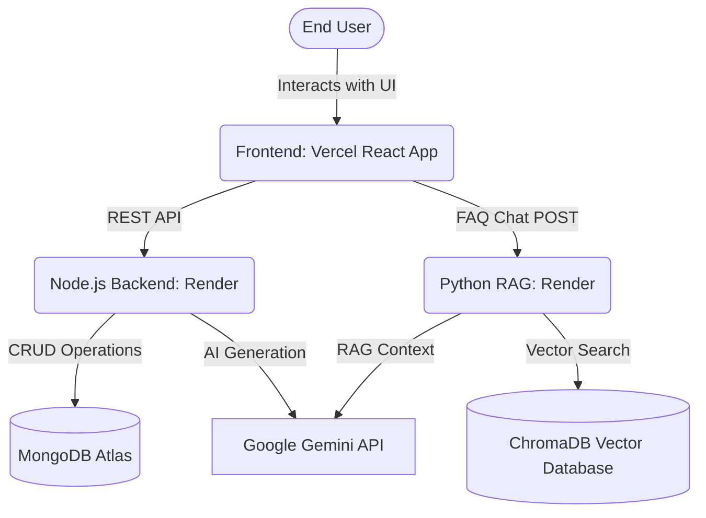
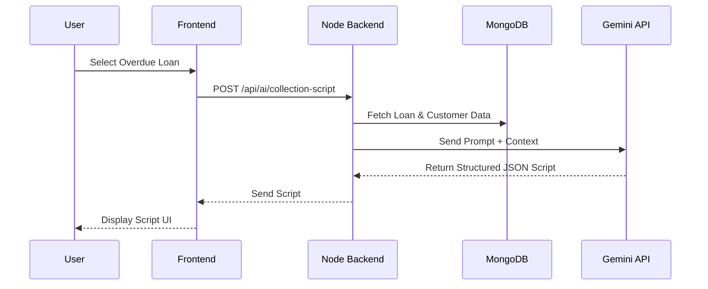
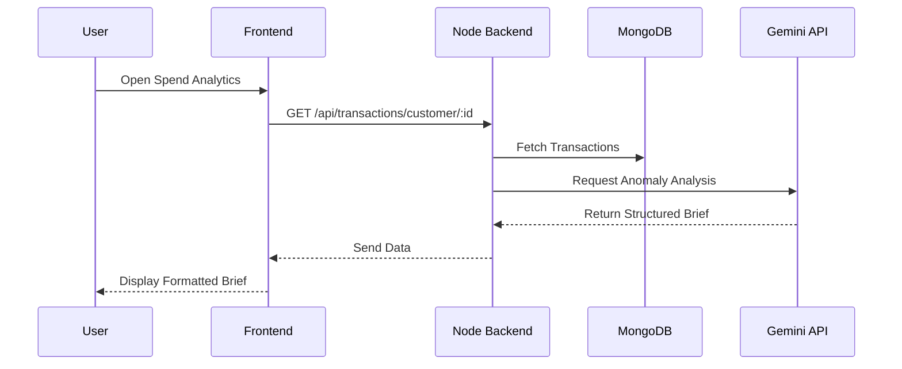
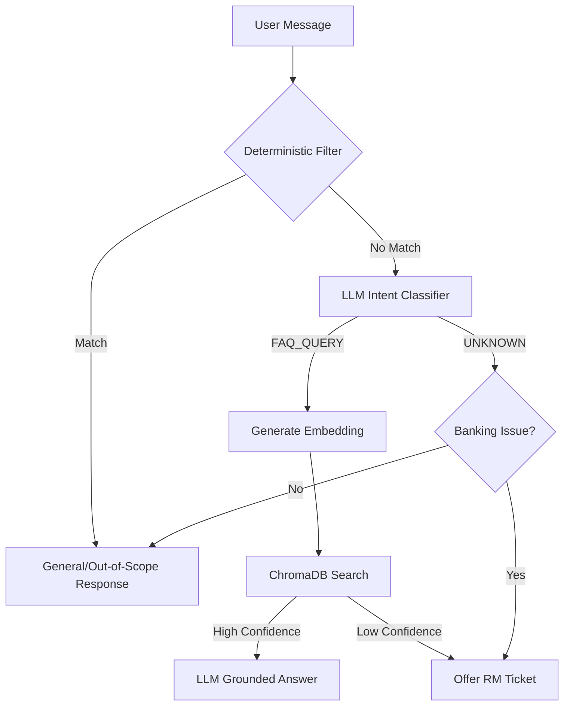
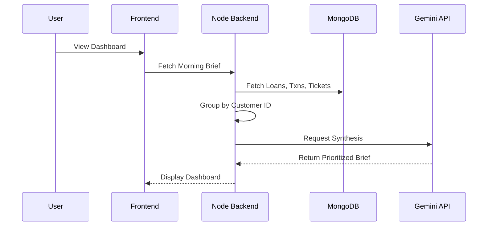

# Ledger Banking AI Platform

## Project Overview
The Ledger Banking AI Platform is an intelligent banking interface designed to assist both Customers and Relationship Managers (RMs). It leverages Google's Gemini LLMs to summarize spend analytics, triage customer tickets, dynamically generate collection scripts, and answer banking FAQs using Retrieval-Augmented Generation (RAG).

## Problem Statement
Banking professionals waste significant time manually synthesizing customer data, transaction histories, and loan statuses to prepare for client interactions. Furthermore, customers struggle to find accurate product information in dense FAQs, leading to unnecessary support tickets. When tickets are needed, there is often no intelligent triage to separate trivial questions from genuine account issues. This platform aims to solve this by introducing an AI-first approach where data is actively analyzed and synthesized into actionable insights for both Relationship Managers (RMs) and Customers.

## Modules & Live URLs
The project is split into three core modules deployed in the cloud:

- **Frontend (React / Vite)**
  - Client URL: `https://ledger-banking-ai-platform-bntx.vercel.app`
  - *(Note: Please update this URL if your Vercel domain is different)*
  
- **Backend (Node.js / Express)**
  - Server URL: `https://ledger-banking-ai-platform-backend.onrender.com`
  - Handles authentication, MongoDB operations, and general AI generation (F1, F2, F4).

- **Python RAG Service (Flask)**
  - Python-RAG URL: `https://ledger-banking-ai-platform.onrender.com`
  - Specialized microservice handling ChromaDB semantic search and RAG for the FAQ Chatbot (F3).

## Final Project Architecture

---

## 1. AI Collections Call-Script Generator (F1)

**What AI Concepts we use:**
- **Structured Prompt Engineering & Few-Shot Prompting:** We use Google's `gemini-3.5-flash` model to transform raw overdue loan data into a strictly formatted 5-part JSON structure (Greeting, Reason, Status, Action, Conclusion). This forces the LLM to balance empathy with financial urgency predictably.

**Workflow Diagram:**

---

## 2. AI Monthly Spend Brief (F2)

**What AI Concepts we use:**
- **AI Anomaly Detection & Summarization:** We use the `gemini-3.5-flash` model to analyze an array of the customer's last 30 days of transactions. The AI acts as a financial analyst, identifying unusual spending spikes across categories and returning a strictly formatted markdown brief with actionable insights.

**Workflow Diagram:**

---

## 3. Product AI Assistant & RAG Chatbot (F3)

**What AI Concepts we use:**
- **Intent Classification:** LLM evaluates the user's message and strictly categorizes it (e.g., `GENERAL_CONVERSATION`, `FAQ_QUERY`, `UNKNOWN`) to intelligently route the software flow.
- **Text Embeddings:** We use `gemini-embedding-2` to convert textual bank policies into mathematical vectors.
- **Retrieval-Augmented Generation (RAG):** We search a Vector Database (ChromaDB) for context, and force the `gemini-3.5-flash` LLM to answer the customer based *exclusively* on that retrieved context, strictly preventing AI hallucinations.

**Workflow Diagram:**

---

## 4. RM Morning Brief Dashboard (F4)

**What AI Concepts we use:**
- **Data Synthesis and Entity Deduplication:** We use `gemini-3.5-flash` to consolidate vast amounts of overlapping data. If a single customer has an overdue loan, a flagged transaction, and a pending support ticket, the AI synthesizes these 3 distinct database records into 1 holistic, prioritized morning action item for the Relationship Manager.

**Workflow Diagram:**

