# 1. Project Overview

**Project Title:** Ledger Banking AI Platform

**Abstract:** 
The Ledger Banking AI Platform is an intelligent banking CRM and customer-facing interface. Built on a hybrid Node.js and Python architecture, it leverages Generative AI (Google Gemini) and Retrieval-Augmented Generation (RAG) to automate collections scripts, analyze spending anomalies, provide an intelligent FAQ chatbot, and generate daily operational summaries for Relationship Managers (RMs).

**Introduction:** 
Traditional banking interfaces rely on static data. This project introduces an AI-first approach where data is actively analyzed into actionable insights. The platform serves two personas: Relationship Managers (who receive operational briefs and call scripts) and Customers (who interact with an intelligent FAQ assistant and view their spending analytics).

**Problem Statement:** 
Banking professionals waste time manually synthesizing customer data and loan statuses to prepare for client interactions. Customers struggle to find accurate product information, leading to unnecessary support tickets. When tickets are needed, there is no intelligent triage to separate trivial questions from genuine account issues.

**Proposed Solution:** 
A unified banking platform that leverages Large Language Models (LLMs) and Vector Databases to provide automated call scripts, AI-driven spending analytics, an intelligent intent-routed RAG chatbot, and an automated morning brief dashboard.

**Objectives:** 
- Reduce RM preparation time for collections.
- Provide customers with easily scannable, AI-generated spending insights.
- Deflect basic customer support inquiries using highly accurate semantic FAQ search.
- Intelligently route unresolved banking issues to an RM ticket system.

**Scope:** 
A complete web application featuring a React frontend, a Node.js backend for business logic, a Python microservice for intent classification and vector search, and a MongoDB database.

**Technologies Used:**

| Technology | Purpose |
| ---------- | ------- |
| **React (Vite)** | Frontend user interface and state management |
| **Node.js & Express** | Primary backend, business logic, F1/F2/F4 AI processing, and Ticket APIs |
| **Python & Flask** | Microservice for F3 (Intent Routing and ChromaDB orchestration) |
| **MongoDB & Mongoose** | Primary database for Customers, Loans, Transactions, Tickets, and FAQs |
| **ChromaDB** | Local Vector Database for semantic FAQ search |
| **Google Gemini API** | LLM provider for generation (`gemini-3.5-flash`) and embeddings (`gemini-embedding-2`) |

---

# 2. Overall Project Architecture

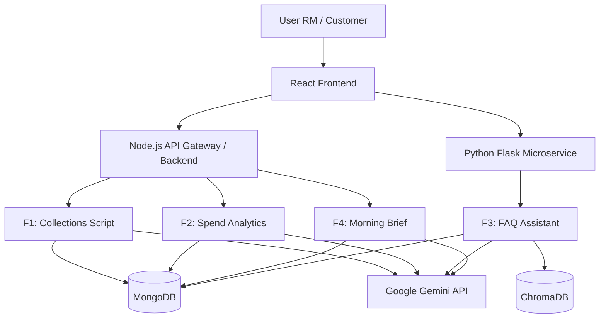

---

# 3. F1 Module: AI Collections Call-Script Generator

### Purpose
To provide RMs with a professional, structured script before calling a customer regarding an overdue loan.

### Features
Generates a strict 5-part JSON structure (Greeting, Reason, Status, Action, Conclusion) dynamically based on the loan's Days Past Due (DPD) and outstanding amount.

### Workflow
1. RM selects an overdue account.
2. Frontend requests script from Node.js API.
3. Node.js fetches Customer & Loan data from MongoDB.
4. Node.js passes data to Gemini with a strict JSON schema prompt.
5. LLM returns structured script.
6. UI displays the script in a readable format.

### Workflow Diagram
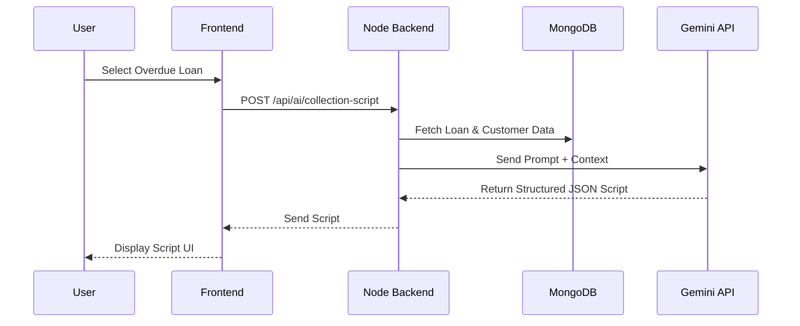

### Architecture Diagram
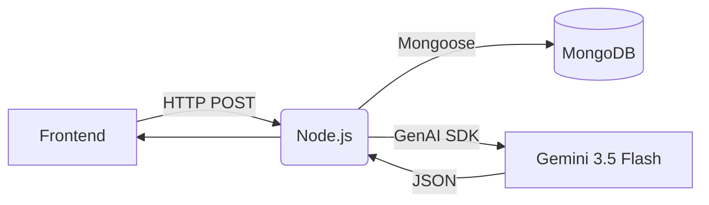

### AI Concepts
- **Concept:** Structured Prompt Engineering & Few-Shot Prompting.
- **Why is it used:** To force the LLM to return reliable, parseable JSON instead of raw text.
- **Input:** Customer Name, Loan Details, DPD, Outstanding Amount.
- **Processing:** LLM synthesizes empathy with financial urgency based on strict instructions.
- **Model:** `gemini-3.5-flash`.
- **Output:** A strict 5-part JSON object.

### Files
- `client/src/pages/CallScript.jsx` (Frontend UI)
- `server/prompts/collectionPrompt.js` (System instructions)
- `server/services/llmService.js` (Gemini API integration)

### APIs
- `GET /api/loans/overdue`
- `POST /api/ai/collection-script`

### Database
- `Customer` Collection
- `Loan` Collection

### Summary
F1 automates the tedious preparation process for collection calls by transforming raw loan data into a structured, empathetic, and professional JSON script.

---

# 4. F2 Module: AI Monthly Spend Brief

### Purpose
To give customers a highly scannable, categorized breakdown of their monthly spending, including anomaly detection.

### Features
Outputs a strict 4-part structure (Summary, Key Insights, Anomalies, Recommendations). Identifies unusual spending spikes deterministically based on historical context.

### Workflow
1. Customer views analytics page.
2. Node.js aggregates the last 30 days of transactions.
3. Data is sent to Gemini with instructions to isolate anomalies.
4. LLM returns a structured markdown/bulleted brief.
5. UI displays formatted text.

### Workflow Diagram
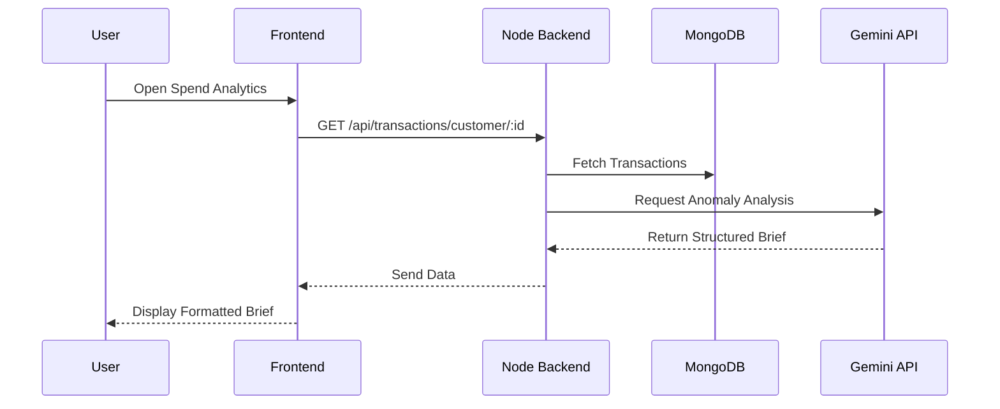

### Architecture Diagram
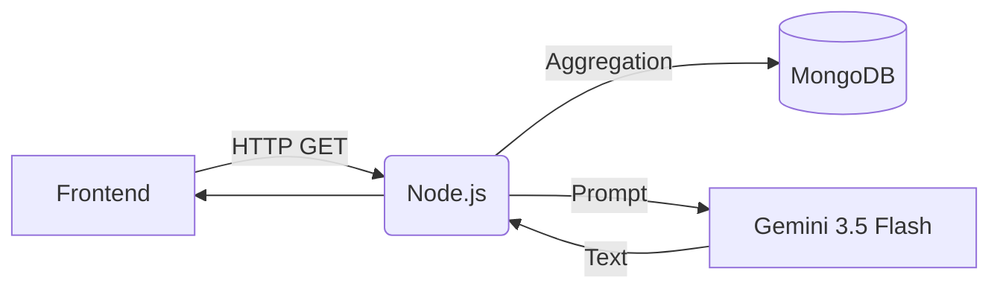

### AI Concepts
- **Concept:** AI Anomaly Detection & Summarization.
- **Why is it used:** To turn hundreds of raw transactions into 2-3 readable bullet points.
- **Input:** Last 30 days of transaction history (Amounts, Categories).
- **Processing:** LLM calculates relative spikes in category spending.
- **Model:** `gemini-3.5-flash`.
- **Output:** Structured plain text/markdown brief.

### Files
- `client/src/pages/SpendingAnalytics.jsx`
- `server/services/llmService.js`

### APIs
- `GET /api/transactions/customer/:id`

### Database
- `Transaction` Collection

### Summary
F2 transforms overwhelming transaction logs into a simple, professional, 4-section financial brief that highlights spending anomalies and offers recommendations.

---

# 5. F3 Module: Product AI Assistant (RAG Chatbot)

### Purpose
A customer-facing chatbot that answers banking queries using RAG and strictly triages genuine issues to RMs.

### Features
Deterministic intent caching, LLM Intent Routing (`GENERAL_CONVERSATION`, `FAQ_QUERY`, `UNKNOWN`), Semantic Search via ChromaDB, and a fallback Ticket Creation UI.

### Workflow
1. User sends message.
2. Python backend applies deterministic keyword checks to catch small talk.
3. If ambiguous, Gemini classifies intent via JSON.
4. If `FAQ_QUERY`, an embedding is generated and ChromaDB is searched.
5. If confidence is high, Gemini generates a grounded answer using *only* retrieved context.
6. If confidence is low or intent is an `UNKNOWN` banking issue, RAG is bypassed and the UI offers a "Raise Ticket" button.

### Workflow Diagram
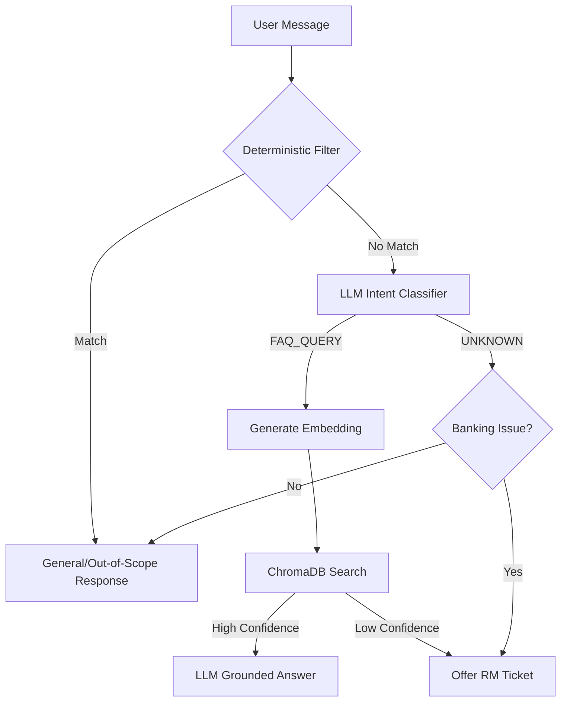

### Architecture Diagram
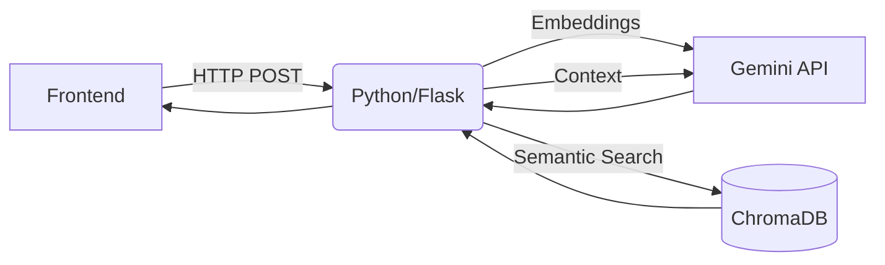

### AI Concepts
- **Concept 1: Intent Classification:** LLM categorizes text into rigid JSON choices to control software flow.
- **Concept 2: Embeddings:** Translating text into mathematical vectors using `gemini-embedding-2`.
- **Concept 3: Retrieval-Augmented Generation (RAG):** Searching a Vector Database (ChromaDB) for context, then forcing the LLM (`gemini-3.5-flash`) to generate answers based ONLY on that context to prevent hallucinations.

### Files
- `client/src/pages/FAQAssistant.jsx`
- `python_rag/app.py`
- `server/scripts/seedData.js` (For ingesting FAQs)

### APIs
- `POST http://localhost:5001/api/ai/faq`
- `POST /api/tickets` (Node.js API for creating the ticket)

### Database
- `ChromaDB` (For embeddings)
- `FAQ` Collection in MongoDB (Source of truth)
- `Ticket` Collection in MongoDB

### Summary
F3 is a highly optimized, quota-efficient RAG pipeline that intercepts user messages, safely answers banking FAQs without hallucinations, and smartly escalates genuine account issues to humans.

---

# 6. F4 Module: RM Morning Brief Dashboard

### Purpose
To provide RMs with a synthesized daily action plan.

### Features
Aggregates overdue loans, suspicious transactions, and pending support tickets. Deduplicates tasks so a single customer with multiple issues is grouped into a single unified action item.

### Workflow
1. RM logs in and requests dashboard.
2. Node.js fetches all overdue loans, pending tickets, and flagged transactions assigned to the RM.
3. Data is aggregated and grouped by `customer_id`.
4. Gemini generates a summarized priority list based on the aggregated data.
5. UI displays the dashboard.

### Workflow Diagram
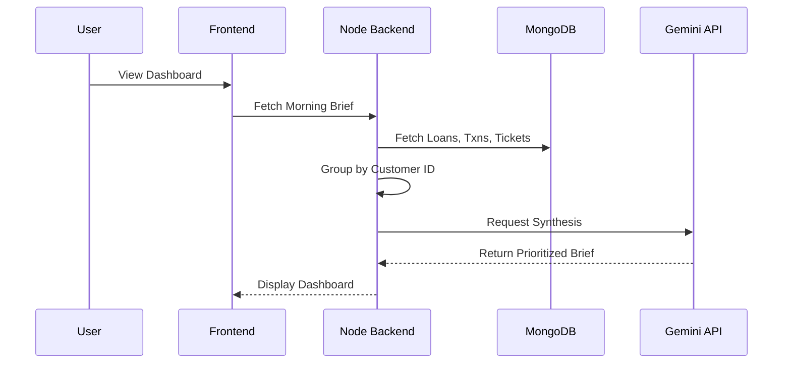

### Architecture Diagram
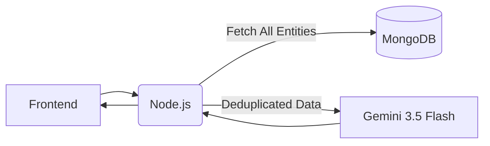

### AI Concepts
- **Concept:** Data Synthesis and Deduplication.
- **Why is it used:** To prevent RM dashboard fatigue by collapsing 3 separate database records (Loan, Ticket, Transaction) into 1 holistic customer summary.
- **Model:** `gemini-3.5-flash`.

### Files
- `client/src/pages/Dashboard.jsx` (or equivalent RM view)
- `server/controllers/mainController.js`
- `server/services/llmService.js`

### APIs
- Handled via RM dashboard initialization endpoints in `mainController.js`.

### Database
- `Customer`, `Loan`, `Transaction`, `Ticket` Collections.

### Summary
F4 acts as the central hub for Relationship Managers, using AI to intelligently group and prioritize cross-domain customer data into a single morning brief.

---

# 7. How F1 + F2 + F3 + F4 Work Together

### Explanation
- **F1 (Call Scripts)** and **F4 (Morning Brief)** are RM-facing modules. 
- **F2 (Spend Brief)** and **F3 (FAQ Chatbot)** are Customer-facing modules.
- **Connection:** They are intrinsically linked via the MongoDB Database and the RM workflow. 
  - When a customer uses F3 and has a genuine issue, F3 generates a **Ticket**.
  - This Ticket is saved to MongoDB.
  - The next morning, **F4** aggregates this Ticket alongside the customer's overdue loans.
  - The RM sees the F4 Morning Brief, clicks on the overdue loan, and opens **F1** to generate a Call Script. 
  - Meanwhile, the customer continues monitoring their health via **F2**.
- All modules utilize the same underlying Google Gemini LLM API, but F3 routes through a dedicated Python microservice due to the ChromaDB dependency.

### Combined Workflow Diagram

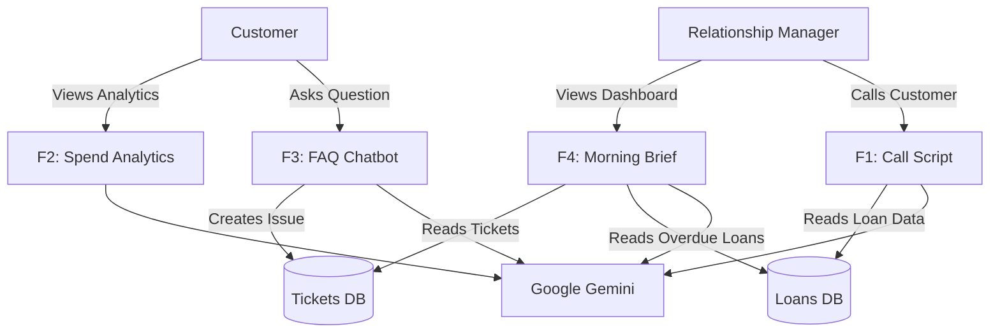

---

# 8. Complete Project Architecture

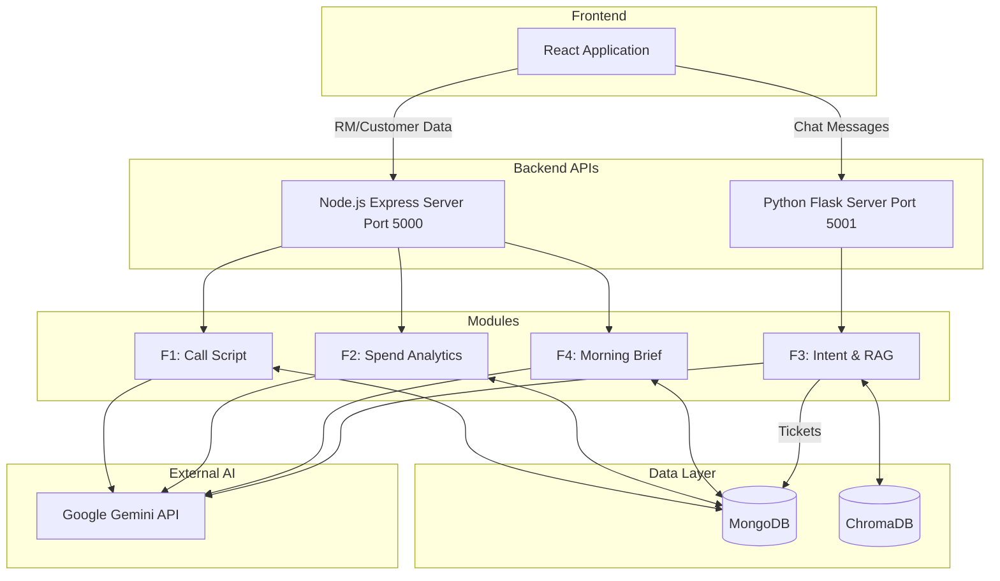

---

# 9. Complete Data Flow

**Data Flow:**
1. **Input:** Customer or RM requests information via the React Frontend.
2. **Routing:** 
   - Standard data requests go to Node.js.
   - Chatbot requests go directly to Python Flask.
3. **Processing:**
   - Node fetches MongoDB records.
   - Python evaluates intents and fetches ChromaDB vectors.
4. **AI Generation:** Context is packaged into prompts and sent to Google Gemini.
5. **Response:** Gemini returns strict JSON or Markdown.
6. **Output:** Backends parse the AI output and return clean HTTP responses to the Frontend for rendering.

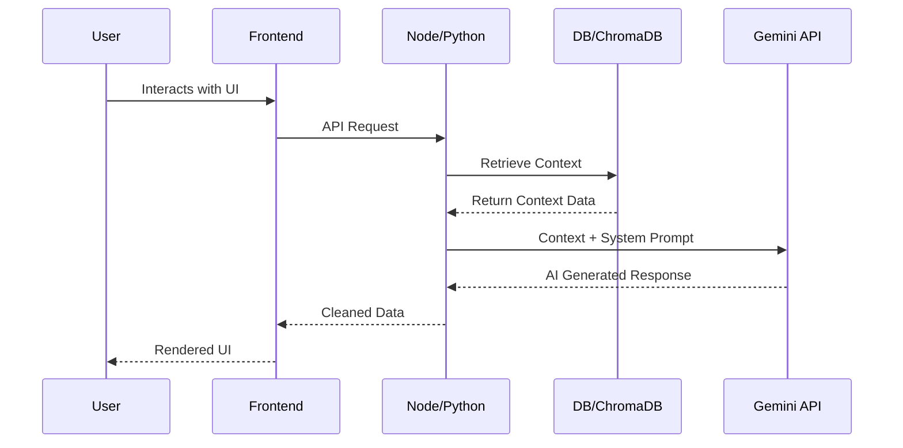

---

# 10. Database

- **Technology:** MongoDB (via Mongoose) and ChromaDB (Local SQLite/Parquet).
- **Collections:**
  - `Customer`: `customer_id`, `account_title`, `working_balance`.
  - `Loan`: `loan_id`, `customer_id`, `outstanding`, `days_past_due`.
  - `Transaction`: `txn_id`, `customer_id`, `amount`, `txn_type`, `category`.
  - `FAQ`: `title`, `body`, `embedding`.
  - `Ticket`: `ticketId`, `customerId`, `question`, `status`.
- **Relationships:** Customers have a 1-to-Many relationship with Loans, Transactions, and Tickets via `customer_id`.
- **CRUD Operations:** Read-heavy operations for Analytics and RAG. Create operations for Tickets. 

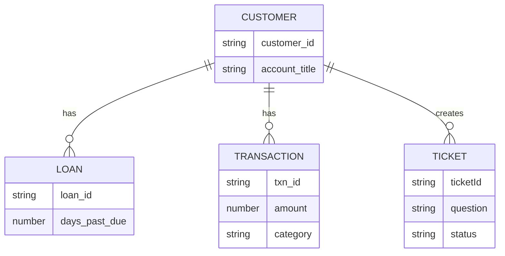

---

# 11. API Documentation

| Method | Endpoint | Module | Purpose |
| ------ | -------- | ------ | ------- |
| `POST` | `/api/ai/faq` | F3 | Evaluates intent and executes RAG for chatbot. |
| `POST` | `/api/ai/collection-script` | F1 | Generates structured call scripts. |
| `GET` | `/api/transactions/customer/:id` | F2 | Fetches history and generates spend brief. |
| `POST` | `/api/tickets` | F3 | Creates RM support tickets. |

**Important Note:** The Python API (`/api/ai/faq`) sits on Port 5001, separate from the primary Node API on Port 5000.

---

# 12. Authentication & Security

- **Authentication:** Mapped via `localStorage.getItem('customerId')` for rapid prototyping.
- **CORS:** Configured on both Node and Python servers to securely accept requests from the Vite frontend port (5173).
- **Environment Variables:** API keys (`LLM_API_KEY`) and Database URIs are secured via `.env` injection.
- **Validation:** Python enforces strict Enum validation on JSON Intent LLM returns. Node strips markdown formatting from LLM JSON strings to prevent `JSON.parse` crashes.

---

# 13. AI Concepts Used in the Complete Project

| Module | AI Concept | Model/API | Purpose |
| ------ | ---------- | --------- | ------- |
| **F1** | Few-Shot JSON Prompting | `gemini-3.5-flash` | Forces LLM to output a strict 5-part script format. |
| **F2** | Anomaly Detection | `gemini-3.5-flash` | Analyzes raw arrays of numbers/categories for spikes. |
| **F3** | Intent Classification | `gemini-3.5-flash` | Routes chats to RAG, Error, or Casual functions. |
| **F3** | Text Embeddings | `gemini-embedding-2` | Converts FAQ text to math vectors for DB storage. |
| **F3** | Vector Retrieval (RAG) | `gemini-3.5-flash` | Grounds chatbot answers exclusively in bank policy. |
| **F4** | Deduplication Synthesis | `gemini-3.5-flash` | Summarizes overlapping database records into one task. |

**AI Flow:** Intent → Embedding → Search → Context Injection → Generation.

---

# 14. Deployment

Currently configured for local, multi-terminal deployment.
- **Frontend:** Vite dev server.
- **Backend:** Node execution environment.
- **Python:** Virtual Environment (`venv`) Flask server.
- **Environment Variables:** Shared `.env` file at project root containing `LLM_API_KEY` and `MONGO_URI`.

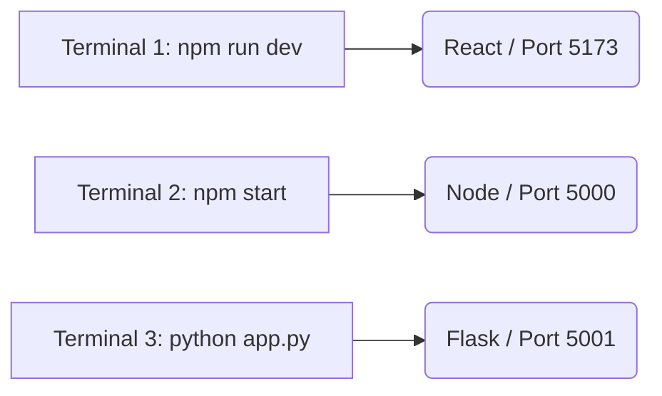

---

# 15. Complete End-to-End Project Working

**Step 1:** Customer logs into application.
**Step 2:** Customer views F2 Spend Analytics. Node backend aggregates 30 days of MongoDB data and Gemini summarizes it.
**Step 3:** Customer asks F3 Chatbot "I got charged an unknown fee."
**Step 4:** Python backend intercepts message. Gemini Intent Classifier identifies it as `UNKNOWN` (Genuine Issue).
**Step 5:** Python offers ticket creation. Customer clicks "Raise Ticket". Node creates ticket in MongoDB.
**Step 6:** Next day, RM logs in.
**Step 7:** F4 Morning Brief aggregates the customer's new ticket and existing overdue loans.
**Step 8:** RM clicks customer profile to call them. F1 queries Gemini to instantly generate a Collection Script.

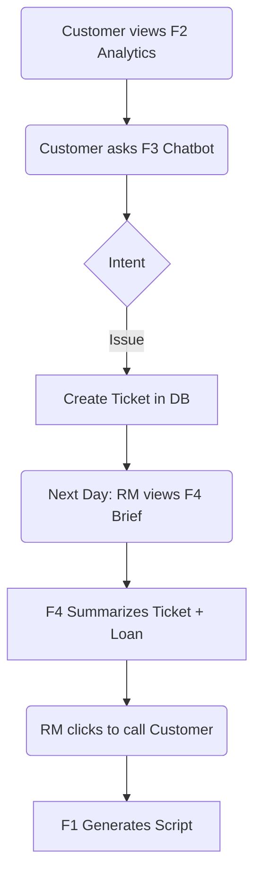

---

# 16. Testing

- **Functional Testing:** F3 intent paths (General, FAQ, Issue, Out-of-Scope) were tested extensively.
- **Rate-Limit Testing:** Evaluated HTTP 429 quota exhaustion; UI safely displays "Please try again" without hallucinating responses.
- **RAG Context Testing:** Ensured Gemini does not invent interest rates outside of ChromaDB context.
*Formal automated tests were not identified in the current implementation.*

---

# 17. Performance

- **Deterministic Caching:** The Python backend manually intercepts `"hi"`, `"fd rates"`, and `"missed emi"` using regex, completely bypassing the Intent Classifier to save 1-2 API calls per routine chat.
- **Deduplication:** F4 merges overlapping customer problems at the API level, drastically reducing the token size sent to the LLM.

---

# 18. Limitations

- **Rate Limits:** Google Gemini Free Tier limits rapid execution (15 requests per minute). F3 can hit this if a user spams questions.
- **Authentication:** Relies on unprotected LocalStorage mock IDs.
- **Vector Storage:** ChromaDB is running locally via SQLite, which is unsuitable for massive horizontal scaling.

---

# 19. Future Enhancements

- **Future Feature:** Transition to a managed cloud vector database (e.g., MongoDB Atlas Vector Search or Pinecone).
- **Future Feature:** Implement full JWT authentication and RBAC to secure RM vs. Customer routes.
- **Future Feature:** Upgrade to a paid LLM tier to handle concurrency without 429 errors.

---

# 20. Conclusion

The Ledger Banking AI Platform successfully demonstrates the power of orchestrated AI microservices. By splitting the logic between Node.js for structured analytical generation (F1, F2, F4) and a specialized Python/ChromaDB layer for semantic RAG (F3), the project maximizes the strengths of both ecosystems. 

The implementation proves that Large Language Models can be securely constrained—using strict JSON schema forcing and rigorous Intent Routing—to prevent hallucinations and provide safe, professional assistance in a high-stakes banking environment. Ultimately, the integration of these four modules forms a closed-loop system where customer issues seamlessly transition into prioritized, AI-assisted tasks for Relationship Managers.
